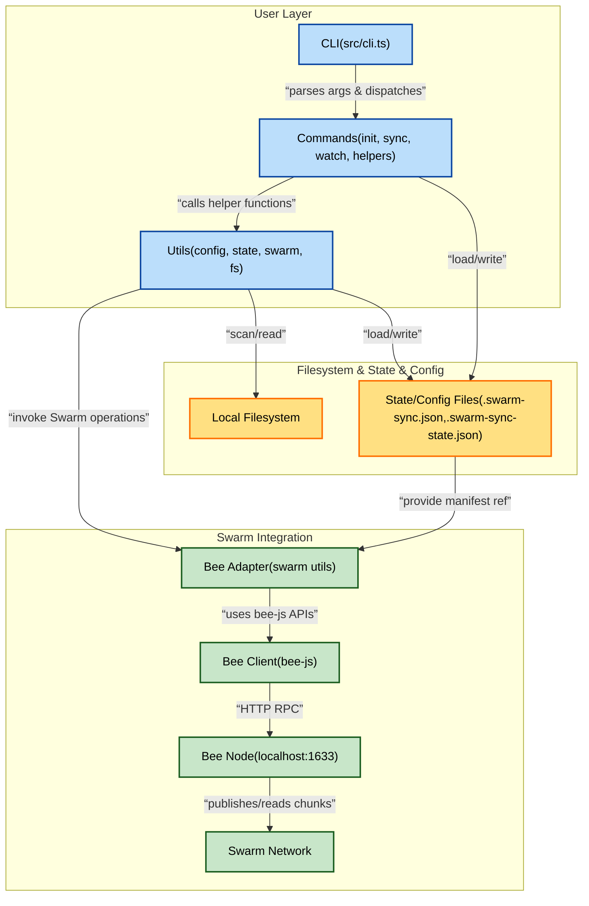

```mermaid
flowchart TB
    %% Subgraphs with custom titles
    subgraph UserLayer["User Layer"]
        direction TB
        CLI["CLI(src/cli.ts)"]:::userComp
        Commands["Commands(init, sync, watch, helpers)"]:::userComp
        Utils["Utils(config, state, swarm, fs)"]:::userComp
    end

    subgraph FileLayer["Filesystem & State & Config"]
        direction TB
        LocalFS["Local Filesystem"]:::fileComp
        StateConfig["State/Config Files(.swarm-sync.json,.swarm-sync-state.json)"]:::fileComp
    end

    subgraph SwarmLayer["Swarm Integration"]
        direction TB
        BeeAdapter["Bee Adapter(swarm utils)"]:::swarmComp
        BeeClient["Bee Client(bee-js)"]:::swarmComp
        BeeNode["Bee Node(localhost:1633)"]:::swarmComp
        SwarmNet["Swarm Network"]:::swarmComp
    end

    %% Connections with labels
    CLI -->|“parses args & dispatches”| Commands
    Commands -->|“calls helper functions”| Utils

    Commands -->|“load/write”| StateConfig
    Utils -->|“scan/read”| LocalFS
    Utils -->|“load/write”| StateConfig

    StateConfig -->|“provide manifest ref”| BeeAdapter
    Utils -->|“invoke Swarm operations”| BeeAdapter

    BeeAdapter -->|“uses bee-js APIs”| BeeClient
    BeeClient -->|“HTTP RPC”| BeeNode
    BeeNode -->|“publishes/reads chunks”| SwarmNet

    %% Styling classes with higher contrast and black text
    classDef userComp fill:#bbdefb,stroke:#0d47a1,stroke-width:2px,color:#000000,rounded corners;
    classDef fileComp fill:#ffe082,stroke:#ff6f00,stroke-width:2px,color:#000000,rounded corners;
    classDef swarmComp fill:#c8e6c9,stroke:#1b5e20,stroke-width:2px,color:#000000,rounded corners;

    %% Assign classes
    class CLI,Commands,Utils userComp
    class LocalFS,StateConfig fileComp
    class BeeAdapter,BeeClient,BeeNode,SwarmNet swarmComp
```